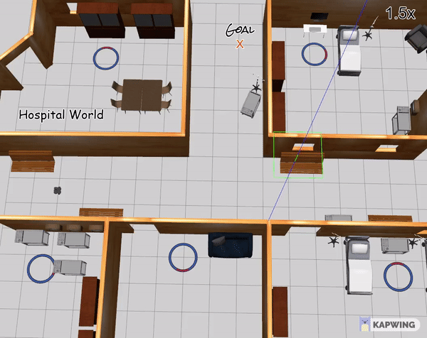

# Dynamic Obstacle Avoidance in Indoor Environment using ORCA in ROS

# Overview

This package is a obstacle avoidance navigation stack developed for ROS Melodic & Ubuntu 18.04. The package uses Velocity-Obstacle method called ORCA(Optimal Reciprocal Collision Avoidance Algorithm) to avoid obstacles. It uses RVO2 library for ORCA & Kalman filters for dynamic object tracking with LiDAR. The package provides felxibility for user to choose start, goal points and planning horizon along with no. of multiple agents to avoid and provide static obstacle data of enviroment to ORCA as RVO vectors. The packages uses Proxemics theory to avoid human and obstacles area of proxemity for Social Aware Navigation through predicting the t+1 RVO velocity.

The package allows user to get Dynamic Obatcle tracking data from DetectedEntity.msg from obstacle tracker package. The novality of this package is to use ORCA along with proxemics predicting whether future velocities lies in collision area or not. This can be further be used to deveop a Behaviour Module over the Motion planner.  


**Keywords:** Velocity Obstacles, ORCA, Proxemics Theory, Social-Aware-Navigation, Obstacle Avoidance. 


**Author: [Nagarjun Vinukonda](https://nagarjunvinukonda.github.io/), Kavit Shah**\
**Affiliation: Worcester Polytechnic Institute**\
**Maintainer: Nagarjun Vinukonda, [nvinukonda@wpi.edu](https://outlook.office365.com/mail/inbox)**

The algorithm has been made to deploy on mobile robots with static indoor environments. 


* **Simulation in Hospital environment**                                 &&                      **Simulation in Hospital Lobby with Laser range =10m**
<!--
<p float="left">  </p> | <p float="right">  </p>
-->
<p float="center">
 
 
</p>	

<!--
* **Simulation in Hospital environment**.                         
<p float="left">                                                   
   
</p>
-->
<!--
* **Simulation in Hospital Lobby with Laser range =10m**.
<p float="right">

</p>
-->


* **Obstacle detector using Kalman filter results:**


* **NOTE:** For more information on Obstacle Detector visit [Master Branch](https://github.com/nagarjunvinukonda/Dynamic-Obstacle-Tracker-and-Avoidance-ORCA/tree/master)

# Installation:

## Dependencies
You will need [turtlebot3](https://github.com/ROBOTIS-GIT/turtlebot3/tree/melodic-devel) & [turtlebot3_simulation](https://github.com/ROBOTIS-GIT/turtlebot3_simulations/tree/melodic-devel) packages.

OpenCV is also needed if you wish to work with certain functionalities of this repo. You can find the installing instruction for OpenCV4 on Ubuntu 18-04 [here](https://www.learnopencv.com/install-opencv-4-on-ubuntu-18.04/)

Don't forget to configure the OpenCV_DIR in the CMakeLists.txt with {path-to-your-OpenCV-library}

## Package modifications

The package is further going to be modified for dynamic obstacles. Please make sure to open issues as per the instructions provided for contributors.   

## Running
Once you have successfully build the project you can run the executables with the following commands from inside your build directory

1. Launching the world file
 * To run the project on static world (with standing humans)
         
         roslaunch env turtlebot3_env_open_spaces_wsh-edit.launch 
        
 * To run the project on dynamic world (with moving humans)  .. [work in progress]

        roslaunch env turtlebot3_env_open_spaces_wwh-edit.launch

2. Run the simulation

* To run the simulation, in another sourced terminal:

        rosrun orca test_sim
	
3. Run Obstacle detector package:
* First run split_scan package, then obstacle tracker:

```
 	roslaunch split_scan split_scan.launch 
```
```
	roslaunch obstacle_detector detector.launch
```


## For Contributors: 

	
* ***NOTE:*** This repo is under going changes for creating new dynaimic obstacle avoidance alagrithm. For stable and working repo, please visit: [static_navigation_ORCA](https://github.com/nagarjunvinukonda/Dynamic-Obstacle-Tracker-and-Avoidance-ORCA/tree/static_navigation_ORCA) Branch.


## References & Useful resources:

* RVO2 library for ORCA for the [code](http://gamma.cs.unc.edu/RVO2/)

* Van Den Berg, Jur, et al. "Reciprocal n-body collision avoidance." Robotics research. Springer, Berlin, Heidelberg, 2011. 3-19.

* https://github.com/ROBOTIS-GIT/turtlebot3/tree/melodic-devel

* https://github.com/ROBOTIS-GIT/turtlebot3_simulations/tree/melodic-devel

* Installing [OpenCV4](https://www.learnopencv.com/install-opencv-4-on-ubuntu-18-04/) for Ubuntu 18.04

* M.Przybyła, “Detection and tracking of 2d geometric obstacles from lrfdata,” in2017 11th International Workshop on Robot Motion and Control(RoMoCo). IEEE, 2017, pp. 135–141

* The Obstacle detecor package created by author is found [here](https://github.com/tysik/obstacle_detector) 

