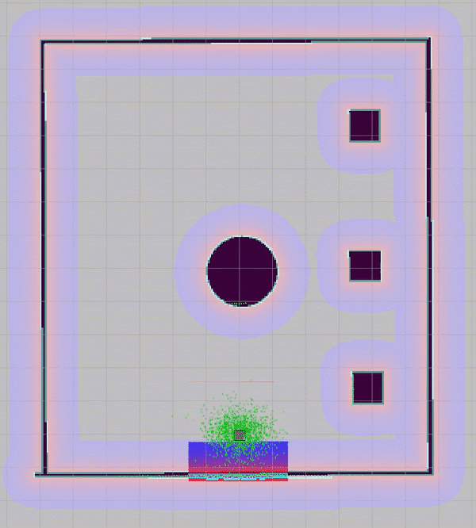

# Dynamic Obstacle Avoidance in Indoor Environment using ORCA in ROS

The repository is our project for achieving dynamic collision avoidance in indoor spaces using Optimal Reciprocal Collision Avoidance algorithm in ROS using C++

The repository employs use of RVO2 library for ORCA & dynamic object tracking with LiDAR using Kalman filters

The package is build and tested for Ubuntu 18.04 with ROS Melodic

 

The algorithm has been made to deploy on mobile robots with static indoor environments

Simulation with Laser range =10m
<p float="center">

</p>

Simulation with Laser range =4m
<p float="center">

</p>

THe obstacle detctor results:


## Dependencies
You will need [turtlebot3](https://github.com/ROBOTIS-GIT/turtlebot3/tree/melodic-devel) & [turtlebot3_simulation](https://github.com/ROBOTIS-GIT/turtlebot3_simulations/tree/melodic-devel) packages.

OpenCV is also needed if you wish to work with certain functionalities of this repo. You can find the installing instruction for OpenCV4 on Ubuntu 18-04 [here](https://www.learnopencv.com/install-opencv-4-on-ubuntu-18.04/)

Don't forget to configure the OpenCV_DIR in the CMakeLists.txt with {path-to-your-OpenCV-library}

## Package modifications

The package is further going to be modified for dynamic obstacles. Please make sure to open issues as per the instructions provided for contributors.   

## Running
Once you have successfully build the project you can run the executables with the following commands from inside your build directory

1. Launching the world file
 * To run the project on static world (with standing humans)
         
         roslaunch env turtlebot3_env_open_spaces_wsh-edit.launch 
        
 * To run the project on dynamic world (with moving humans)  .. [work in progress]

        roslaunch env turtlebot3_env_open_spaces_wwh-edit.launch

2. Run the simulation

* To run the simulation, in another sourced terminal:

        rosrun orca test_sim
	
3. Run Obstacle detector package:
* First run split_scan package, then obstacle tracker:

```
 	roslaunch split_scan split_scan.launch 
```
```
	roslaunch obstacle_detector detector.launch
```


## For Contributors: 

	
* In order to understand more about the RVO2 library & ORCA algorithm please refer the paper and library webpage available in references

* To understand about interacting with the library please refer the orca->src->test_sim_Function_Information.txt

* While making any new changes, please update the CHANGELOG.rst files in the base folder and in each package about the changes made. Creating a new branch for the change would be highly adviced.


* Note: This package is for my further modifications and testing. If you like to add issues, I recommend add it to main branch https://github.com/KavitShah1998/DynamicObstacleAvoidance/tree/human_and_obstacle_tracking. 

* Your contributions are truly appreciated


## References & Useful resources

* RVO2 library for ORCA for the [code](http://gamma.cs.unc.edu/RVO2/)

* Van Den Berg, Jur, et al. "Reciprocal n-body collision avoidance." Robotics research. Springer, Berlin, Heidelberg, 2011. 3-19.

* https://github.com/ROBOTIS-GIT/turtlebot3/tree/melodic-devel

* https://github.com/ROBOTIS-GIT/turtlebot3_simulations/tree/melodic-devel

* Installing [OpenCV4](https://www.learnopencv.com/install-opencv-4-on-ubuntu-18-04/) for Ubuntu 18.04

* M.Przybyła, “Detection and tracking of 2d geometric obstacles from lrfdata,” in2017 11th International Workshop on Robot Motion and Control(RoMoCo). IEEE, 2017, pp. 135–141

* The Obstacle detecor package created by author is found [here](https://github.com/tysik/obstacle_detector) 

